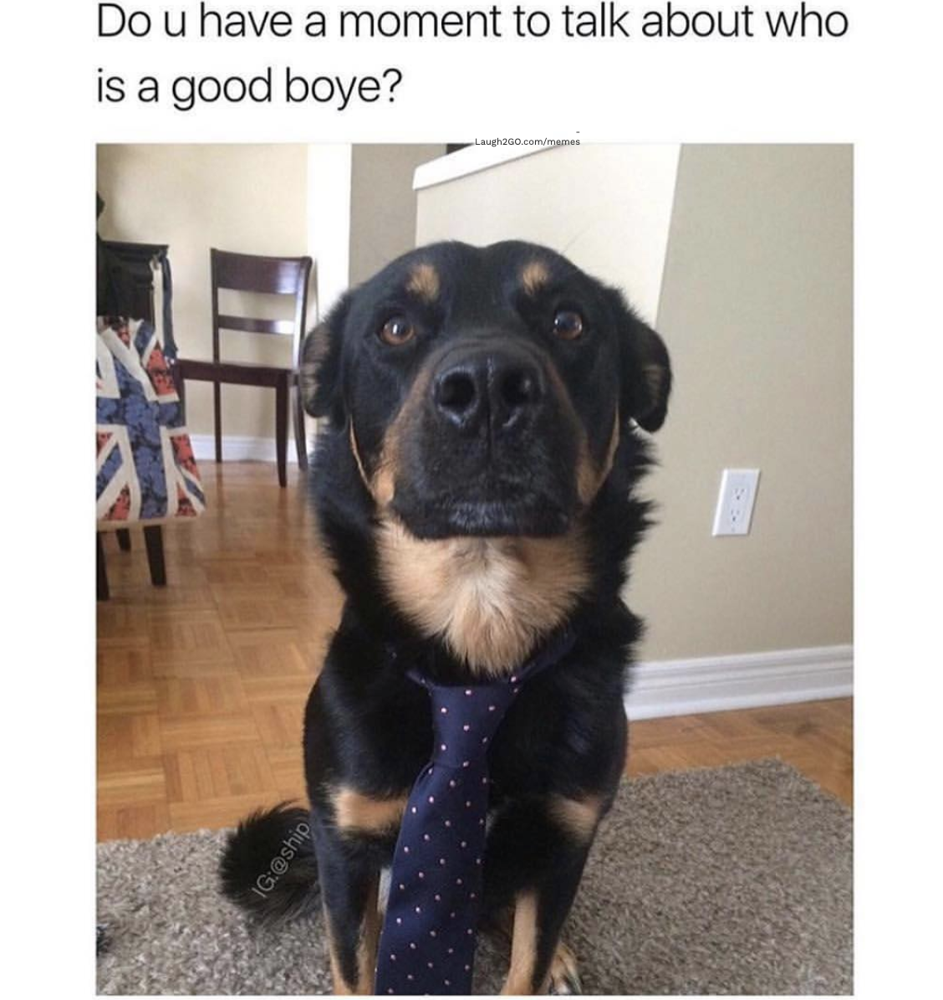

# Good Boye Grades
#### Description
*Have you ever seen a dog and though "Wow, what a good boye!"? Now, you can declare just how good they are! Just a few clicks from the landing page and you're ready to go!*

[Open App](https://good-boye-grades.herokuapp.com/)

#### Technologies Used:
*Mongoose, Express, Node, HTML, CSS, Javascript*

#### Getting Started

*Click login and continue using your Google account. Then, click the title to begin. Enter a rating from 1 to 10 and click to save or hit return. The next randomly generated dog photo will appear automatically. Follow the link to the ratings page to see all previous dogs and their corresponding grades.* 

#### Core Functionality
- Login using OAuth
- View randomly generated photos of dogs
- Enter and save rating from 1 to 10 for each photo
- Edit/update rating
- Delete rating
- View photos previously rated

#### Upcoming Functionality
- Add, save, edit, delete notes on photo
- Add your own photos
- Add friends
- View friends' ratings
- View friends' added photos
- View your top/bottom/average rated
- View your friends' top/bottom/average rated
- View global ratings
- Mark favorite dogs

 
---

