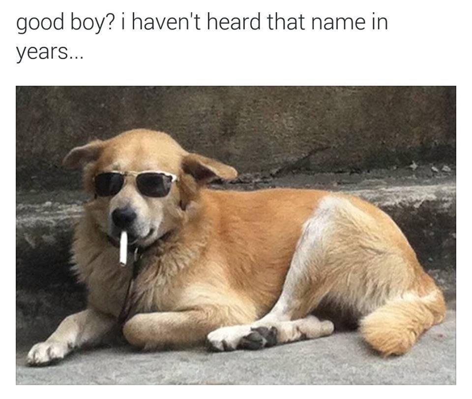
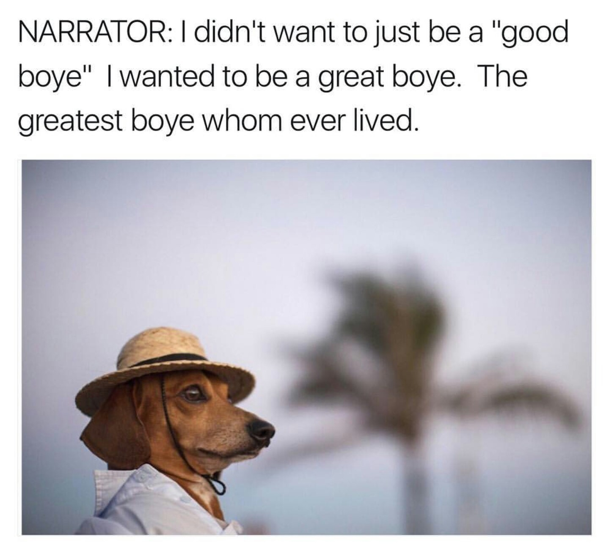

# Good Boye Grades
#### Description
*Have you ever seen a dog and though "Wow, what a good boye!"? With Good Boye Grades, you get to declare just how good of a boye they are! Just a few clicks from the landing page and you're ready to go. No need to create an account, OAuth will take care of that for you. Save your ratings, view your top and bottom rated, add friends and view their ratings, even submit your own dog photos for grading!*

[Open App](http://underconstruction)

#### Technologies Used:
*Javascript, Express, Node, MongoDB, APIs, OAuth*

#### Getting Started

*Click login graphic and sign in using Google. Then, click "Go" to begin! To enter a rating, simply type a number (0-10), watch as it appears on-screen and hit enter to save. The next randomly generated dog photo will appear automatically.* 

#### Core Functionality
- Create account using OAuth
- View randomly generated photos of dogs
- Enter and save rating from 0 to 10 for each photo
- Edit/update rating
- Delete rating
- View photos previously rated

#### Upcoming Functionality
- Add, save, edit, delete notes on photo
- Add your own photos
- Add friends
- View friends' ratings
- View friends' added photos
- View your top/bottom/average rated
- View your friends' top/bottom/average rated
- View global ratings
- Mark favorite dogs

 

---

---
